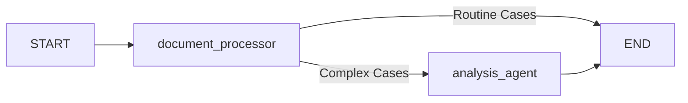

# Financial Transaction Analysis System with Episodic Memory

⚠️ **Note: This is a demonstration project** showcasing how LLMs and memory systems can be combined to create intelligent processing workflows. This is not a production-ready financial system and should not be used for real financial transactions.

This toy example demonstrates a financial transaction analysis system that leverages LLMs (Large Language Models) and dual memory systems to process, analyze, and make intelligent decisions about financial transactions. It serves as an educational example of combining modern AI technologies to create smart processing pipelines.

## 🎓 Learning Objectives

This demonstration project shows how to:

- Implement dual memory systems (Episodic and Semantic) with LLMs
- Create intelligent processing workflows using LangGraph
- Build pattern detection and learning capabilities
- Structure decision-making pipelines

## 🌟 Key Features

- **Dual Memory System**

  - Episodic Memory: Example of storing and retrieving transaction decisions
  - Semantic Memory: Demonstration of rules and knowledge storage

- **Intelligent Processing Pipeline**

  - Example of initial triage and classification
  - Demonstration of pattern detection
  - Sample risk rule application
  - Example of detailed analysis for complex cases

- **Learning System Demonstration**
  - Shows how to store decisions for future reference
  - Examples of pattern detection
  - Demonstrates decision-making based on historical data

## 🏗️ Architecture

The system uses a two-node graph structure:



### Components

1. **Document Processor**

   - Initial triage of transactions
   - Pattern detection
   - Risk assessment
   - Classification (routine vs. high-risk)

2. **Analysis Agent**
   - Detailed analysis of complex cases
   - Access to historical data
   - Tool-based processing
   - Final recommendations

## 💾 Memory Systems

### Episodic Memory

Stores transaction decisions with:

- Transaction details
- Risk factors
- Classification
- Reasoning
- Timestamp

Example structure:

```python
memory_entry = {
    "timestamp": "2024-03-20T10:30:15",
    "document": {
        "type": "transaction",
        "risk_level": "high",
        "amount": 15000,
        "transaction_type": "international"
    },
    "analysis": {
        "classification": "respond",
        "reasoning": "High-value international transfer",
        "risk_factors": ["high_value", "international"],
        "requires_reporting": true
    }
}
```

### Semantic Memory

Stores:

- Risk threshold rules
- Compliance requirements
- General financial knowledge
- Exchange rates

## 🔄 Transaction Processing Flow

1. **Input Processing**

   ```python
   transaction = {
       "doc_type": "transaction",
       "risk_level": "high",
       "content": "International wire transfer",
       "amount": 15000,
       "type": "international",
       "metadata": {"transaction_id": "TX123"}
   }
   ```

2. **Initial Analysis**

   - Check similar past decisions
   - Detect patterns
   - Apply risk rules
   - Make initial classification

3. **Routing**
   - Routine transactions → Automatic processing
   - High-risk transactions → Detailed analysis

## 🛠️ Technical Stack

This demonstration uses these technologies:

- **LangChain**: Example of LLM orchestration
- **LangGraph**: Demonstration of workflow management
- **Memory**: Example implementation using Langmem
- **LLM**: Demonstration using OpenAI GPT-4o

## 🎯 Use Cases

These example scenarios demonstrate the system's capabilities:

1. **Simple Transactions**

   - Basic salary deposit examples
   - Low-value transfer demonstrations
   - Standard payment simulations

2. **Complex Scenarios**
   - Sample international transfers
   - Multiple transaction pattern examples
   - Demonstration of rule triggering
   - Example compliance checks

## 🚀 Getting Started

1. Clone the repository and create a virtual environment:

   ```bash
   git clone <repository-url>
   cd <repository-name>
   python -m venv venv
   source venv/bin/activate  # On Windows: venv\Scripts\activate
   ```

2. Install dependencies:

   ```bash
   pip install -r requirements.txt
   ```

3. Set up environment variables in `.env` file:

   ```bash
   OPENAI_API_KEY=your_api_key
   ```

4. Run the demonstration:
   ```bash
   python -m financial_agent.py
   ```

This will run the example transactions defined in the `__main__` section of the program, demonstrating:

- Storage of risk rules
- Processing of exchange rate information
- Handling of various transaction types
- Memory system in action

## 🧠 Learning Capabilities

The key advantage of this architecture is its ability to learn and improve over time:

- **Memory System**: Stores both specific transactions (episodic) and general rules (semantic)
- **Learning Process**: Each new transaction adds to the system's knowledge base
- **Improved Decisions**: Future decisions benefit from past experiences and patterns

Example of how a decision is stored for learning:

```python
memory_entry = {
    "document": {"type": "transaction", "risk_level": "high"},
    "analysis": {
        "classification": "respond",
        "reasoning": "High-value international transfer"
    }
}
```

⚠️ Note: This is a demonstration implementation to show the learning concept. Production systems would need additional features for robust learning capabilities.

## 🔮 Future Potential

This architectural pattern demonstrates powerful concepts for financial analysis systems:

- **Memory-Enhanced Decision Making**: The combination of episodic (transaction history) and semantic (rules) memory provides a strong foundation for sophisticated financial analysis systems.
- **Learning from Experience**: The system's ability to reference past decisions and detect patterns could be extended to:

  - Fraud detection systems
  - Risk assessment platforms
  - Trading analysis tools
  - Compliance monitoring systems

- **Flexible Processing Pipeline**: The two-node architecture (processor + analyzer) could be adapted for various financial use cases, each with its own specialized analysis needs.
